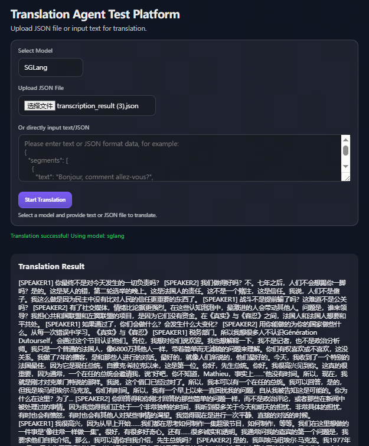
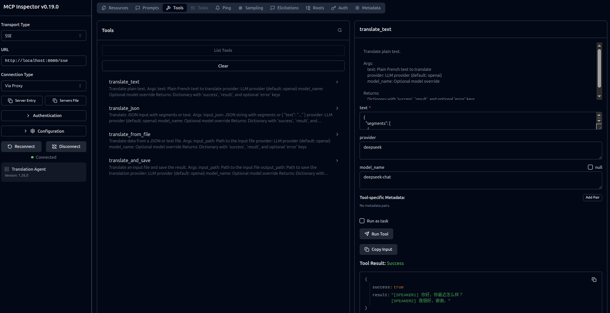

## InnoFrance Translation Agent

Product-grade French-to-Chinese colloquial translation for multi-speaker transcripts. Use the web UI, CLI, or MCP server (stdio or SSE) to integrate with local tools and LLM workflows.



### Key Features

- FastAPI service with a clean web UI and form endpoint
- CLI for batch translation
- MCP server for LLM workflows (stdio or SSE transport)
- Multi-provider support: OpenAI, Ollama, Qwen, GLM, DeepSeek, SGLang, VLLM
- Prometheus metrics, structured logs, and configurable inputs

### Requirements

- Python 3.10+
- Network access to your chosen LLM provider

### Setup

```bash
pip install -r requirements.txt
```

Environment variables are optional. A sample file is provided:

```bash
cp env.example .env
```

### Run the Web Service

```bash
uvicorn app.main:app --host 0.0.0.0 --port 8000 --reload
```

Open `http://localhost:8000`.

### Web UI

- Select provider and required model name
- Upload JSON or plain text
- View and copy translation output

### API Usage (curl)

Translate a JSON file:

```bash
curl -X POST http://localhost:8000/translate \
  -F "provider=openai" \
  -F "model_name=gpt-4o-mini" \
  -F "file=@test_data/sample.json"
```

Translate text directly:

```bash
curl -X POST http://localhost:8000/translate \
  -F "provider=openai" \
  -F "model_name=gpt-4o-mini" \
  -F 'text_input={"segments":[{"text":"Bonjour, comment allez-vous?","speaker":"SPEAKER1"}]}'
```

Model name (required):

```bash
curl -X POST http://localhost:8000/translate \
  -F "provider=sglang" \
  -F "model_name=my-custom-model" \
  -F "file=@test_data/sample.json"
```

### CLI Usage

```bash
# Basic usage
python -m app.cli --input test_data/sample.json --provider openai --model-name gpt-4o-mini

# Save output to file
python -m app.cli --input test_data/sample.json --output result.txt --provider openai --model-name gpt-4o-mini

# Override model name
python -m app.cli --input test_data/sample.json --provider deepseek --model-name deepseek-chat
```

CLI options:
- `--input`, `-i`: Input file path (JSON or TXT) (required)
- `--output`, `-o`: Output file path (optional, defaults to stdout)
- `--provider`, `-p`: LLM provider (openai, ollama, qwen, glm, deepseek, sglang, vllm)
- `--model-name`, `-m`: Model name (required)
- `--prompt-type`: Prompt type (`translate`, `summary`, `check`)

### MCP Server (stdio)

```bash
python -m app.mcp_server
```

Add to your MCP client configuration:

```json
{
  "mcpServers": {
    "translation-agent": {
      "command": "python",
      "args": ["-m", "app.mcp_server"]
    }
  }
}
```

### MCP Server (SSE)

```bash
python -m app.mcp_server --transport sse --host 0.0.0.0 --port 8000
```

Use your MCP client to connect to the server host and port. The exact SSE endpoints are managed by FastMCP, and the host/port are configured when FastMCP is initialized.



### MCP Tools

- `translate_text(text, model_name, provider="openai", prompt_type="translate")`
- `translate_json(input_json, model_name, provider="openai", prompt_type="translate")`
- `translate_from_file(input_path, model_name, provider="openai", prompt_type="translate")`
- `translate_and_save(input_path, output_path, model_name, provider="openai", prompt_type="translate")`

### Input Format

JSON input:

```json
{
  "segments": [
    {
      "text": "Bonjour, comment allez-vous?",
      "speaker": "SPEAKER1"
    },
    {
      "text": "Je vais bien, merci.",
      "speaker": "SPEAKER2"
    }
  ]
}
```

Each segment contains:
- `text`: French text to translate
- `speaker`: Speaker identifier for context

### Output Format

The translation result is returned as a single text block with speaker context preserved.

### Environment Variables

`env.example` lists all supported environment variables and sample values.

General:
- `LOG_LEVEL`: `DEBUG|INFO|WARNING|ERROR` (default `INFO`)
- `LOG_FILE`: log file path (default `logs/translation_agent.log`)
- `WEB_LOG_FILE`: web log file path (default `logs/web_app.log`)
- `PROMETHEUS_PORT`: metrics port (default `8001`)
- `ENABLE_METRICS`: enable metrics (`true|false`, default `true`)
- `INPUT_MAX_TOKENS`: max input tokens per request (default `3000`)
- `TOKEN_CHAR_RATIO`: chars-per-token heuristic (default `4`)

Provider configuration:
- `OPENAI_API_KEY`, `OPENAI_API_BASE`, `OPENAI_MODEL`
- `OLLAMA_API_BASE`, `OLLAMA_MODEL`
- `DASHSCOPE_API_KEY`, `QWEN_API_BASE`, `QWEN_MODEL`
- `ZHIPUAI_API_KEY`, `GLM_API_BASE`, `GLM_MODEL`
- `DEEPSEEK_API_KEY`, `DEEPSEEK_API_BASE`, `DEEPSEEK_MODEL`
- `SGLANG_API_KEY`, `SGLANG_API_BASE`, `SGLANG_MODEL`
- `VLLM_API_KEY`, `VLLM_API_BASE`, `VLLM_MODEL`

### Metrics

Prometheus metrics are exposed at `http://localhost:8001/metrics` when metrics are enabled:

- `translation_requests_total`
- `translation_duration_seconds`
- `active_translations`
- `api_errors_total`

### Project Layout

```
InnoFranceTranslateAGENT/
├── app/
│   ├── main.py
│   ├── cli.py
│   ├── mcp_server.py
│   └── __init__.py
├── core/
│   ├── translator_agent.py
│   ├── utils.py
│   ├── translate.md
│   ├── summary.md
│   ├── check.md
│   └── backend/
│       ├── configs/
│       └── provider/
├── config.py
├── logger.py
├── metrics.py
├── main.py
├── requirements.txt
├── static/
├── templates/
├── test_data/
└── docs/
```